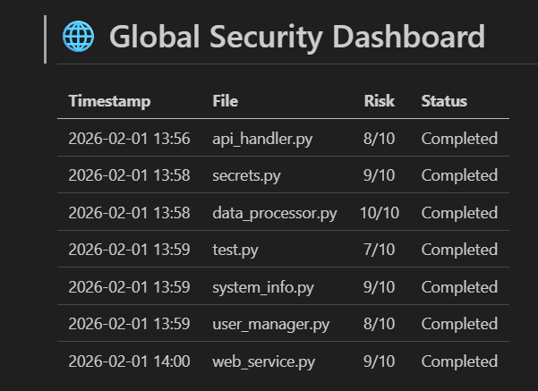
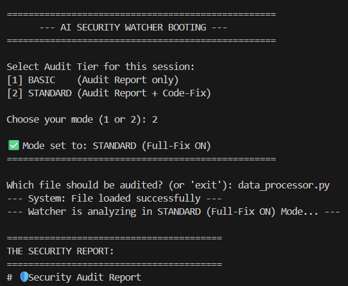
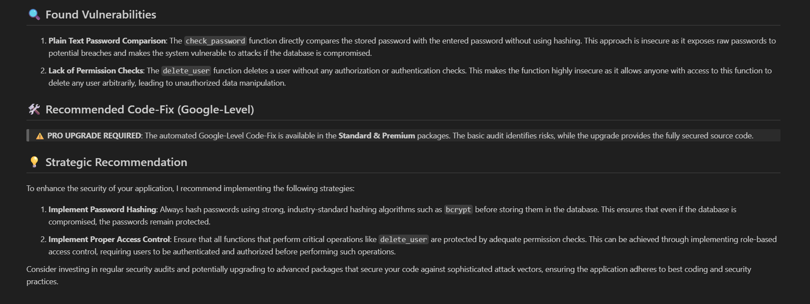
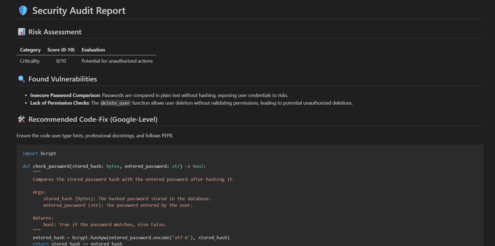

# 🛡️ AI Security Watcher

**Automated AI-Driven Security Auditing for Python Applications.**

This high-end tool analyzes source code for critical vulnerabilities, generates professional audit reports, and provides an optional **Auto-Fix Engine** for production-ready code at a Senior Developer (Google-Level) standard.

---

## 💎 Tiered Service Architecture
To support different business needs, the AI Security Watcher operates in two distinct modes:

1. **Basic Audit Mode:** Provides a comprehensive risk assessment and vulnerability report. Ideal for initial security overviews.
2. **Standard/Premium Fix Mode:** Includes everything in Basic, plus the **Automated Code-Fix Engine** which refactors insecure code into professional, secured source code.

---

## 🔑 Key Features
* **Deep Code Audit:** Comprehensive analysis powered by GPT-4o, focusing on security, logic, and performance.
* **Smart Path Discovery:** Automatically searches for files in the root directory and the dedicated `targets/` folder.
* **Tiered Reporting:** High-quality Markdown reports tailored to the selected service level.
* **Auto-Fix Engine (Standard+):** Generates secure, PEP8-compliant code including Type Hints and professional Docstrings.
* **Automated Verification:** Internal function testing of the corrected code to ensure reliability.
* **Global Security Dashboard:** A centralized overview of all scans, risk scores, and audit history.

---

## 📊 Global Security Dashboard
The system provides continuous monitoring of all scan processes. All results are automatically logged with timestamps, risk scores, and status updates:



---

## 🔍 How it Works

### 📁 File Placement & Smart Search
Place the Python files you want to audit either in the main directory or inside the **`targets/`** folder. The AI Watcher is designed to find your files automatically—you only need to enter the filename.

### 🚀 Interactive Selection
Upon startup, the user chooses the desired service level. This interaction ensures the correct business logic is applied to the audit.


*The interactive terminal allows for quick switching between service tiers.*

---

## 🔍 Audit & Reporting (Basic vs. Standard)

### Basic Tier: Professional Risk Assessment
In Basic mode, the tool identifies critical flaws while locking the automated fix behind a professional upgrade prompt.


*Example of a Basic Audit Report with the "PRO UPGRADE" notification.*

### Standard Tier: Automated Google-Level Fix
In Standard mode, the agent provides the full, refactored code block ready for production. The generated report is automatically prefixed with **FIX_** for easy identification.


*Example of a Standard Report (FIX_Report_...) featuring the full "Recommended Code-Fix" section.*

---

## 🛡️ Code Optimization (Before vs. After)
Our agent doesn't just find bugs; it rewrites insecure logic using industry-standard libraries. Below is an example of the AI identifying insecure `pickle` deserialization and replacing it with a secure `json` implementation.


*Direct comparison: Insecure source code (left) vs. Secured Google-Level refactoring (right).*

---

## 📁 Project Structure (Google-Level)
```text
KI-AGENT/
├── targets/              # Place files to be audited here (e.g., test.py)
├── results/              # Generated Security Reports and Fixed Code
├── images/               # Documentation assets (Screenshots)
├── watcher.py            # Main AI Agent Application
├── config.py             # Central Configuration
└── requirements.txt      # Project Dependencies
```

---

🛠️ Tech Stack
* Language: Python 3.13
* AI Engine: OpenAI GPT-4o
* Security Standards: OWASP Top 10 focused, PEP8 Compliant

---
Created by Costa-Brandon Andrikoglou | AI Security Architect
